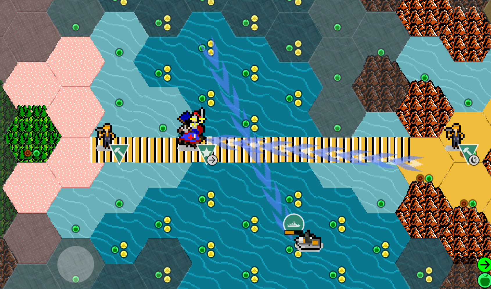

Author: hackedpassword

# Hybrid tile tech: The birth of hybrid tiles, i.e. Bridges! A mod-hack, not a code hack, thus legitimate.



## The Reveal

The basic magic making this work:

Terrains.json:
```
	    "name": "Bridge1ocean",
	    "type": "NaturalWonder",
	    "turnsInto": "Force",  // or Hill, any terrainFeature
	    "unbuildable": true,
```

The basic assembly process looks like:


_You’ll want to read on before jumping into this, there’s a bit more to it._


## How

Because the engine allows `turnsInto:` to accept a `TerrainFeature` as `Type:String`, apparently neither Land or Water units are implied, becoming (sort of) “whatever” (vs Any, neither, both, null). That's my observation at least.

Credit unwittingly goes to A1y0sh4 for inadvertently applying this strange behavior to Rock of Gibraltar in [the Great Unciv Rework](https://github.com/A1y0sh4/The-Great-Unciv-Rework) versions <= 2.1. I recognized when the Wonder tile was placed next to a Coast, unit mobility behavior acted like a canal tile. Experiments proved bridge building with this technique was possible.


## Features

Land units can cross bridge/hybrid tiles withough embarking, while Water units can cross bridge/hybrid tiles without impedement.

Not just bridges, but also, in the case of Z2, _secret water paths_ Land units can traverse using CoastTile or OceanTile.

Hybrid tiles do not count in continent calculations, meaning “attached” lands can now be split! You’ll find “Maze Island” is a different continent than the central continent even though they are adjoined by a bridge.

Advanced usage of continent splitting is possible by say, creating a Mountain as a hybrid, then bordering land to split it.


The hidden water path above hosts a land unit, non-embarked. The submarine cannot target the unit on top of the water. 

## Nuances

It’s not quite as simple to implement as you’d think. Directional combinations of bridge building except N-S is tricky, with angle bridges being untried at this time. On second thought they’re probably not too much harder.

N-S in Z2 is represented by Bridge3. Tile laid down, easy peasy.

W-E in Z2 is represented by Bridge1 and Bridge2, where 1 is top, 2 is bottom. Hex tile interlacing requires a 1-2-1-2 etc pattern to establish the horizontal path for consistent aesthetics. Land units appear proper standing on tile 2, but on tile 1 they stand in the water. Solvable with more dedicated tiles.

Secondly on W-E bridges, endpoints are rendered over by the next row of tiles, rendering the graphic overlays clipped. To solve this, a terrainFeature called BridgeFL (feature left) and BridgeFR (feature right) are applied to the shoreline tile.

Angle bridges are an entire project on their own, but doable. Likely a variant of the above technique.

I implemented OceanTile with movement=0 as the Raft crosses in one movement. Once, Unciv crashed due to the AI zig-zagging back and forth on the water infinitly. Yairm210 figured this out using his code-ray vision. Basically, until float movement values are implemented, not a good idea to use zero.


## Issues

I've explored implementing hybrid tiles with reasonable depth. Here's what I've found. There's a number of features that just do not work, or, maybe could work.

GlobalUniques.json

```
	"Double movement in [OceanTile] <for [land units] units>",
	"Double movement in [CoastTile] <for [land units] units>"
	// Land units are to receive a movement bonus that does not affect water units, doesn’t work
```
	
Terrains.json

```
 "name": "CoastTile",
	"name": "OceanTile",
	"uniques": ["Rare feature","Units ending their turn on this terrain take [30] damage",
// won't trigger:  <for [land units] units>
// Land units are to receive damage for standing around in rough seas
// Water units also take damage here which they aren’t supposed to

<except [terrainFilter] tiles>
// does not exist. Should be a way to disable building roads/railroads on hybrid tiles
```

* Wonders are bottom-layer tiles, meaning alpha transparency can’t work, so underlying terrain must be built into the Wonder tile .png image.


Units.json

```
”May not settle on [baseTerrain] tiles”
// does not exist, reviewed varieties of hacky ways to prevent settlement on hybrid tiles
```

TileImprovements.json

```
	"name": "Road",
	"name": "Railroad",
	"terrainsCanBeBuiltOn": ["Land"],
"uniques": [	"Cannot be built on ["Natural Wonder","Water"] tiles"
"Cannot be built on ["Great Improvements", "Great"] tiles"
// these don’t work. See https://yairm210.github.io/Unciv/Modders/Unique-parameters/#improvementfilter
	
	"name": "Bridge",
	"terrainsCanBeBuiltOn": ["Coast","CoastTile","Ocean"],
	// Cannot be placed on CoastTile
	// Improves Foundation (resource) but does not provide Land mobility
```

TileResources.json

```
	// 5th palace heart on the sea (oil platform) cannot use CoastTile as terrain tile, remains Coast
	// How to put resources/improvements on wonders?

	"name": "Foundation",
	"resourceType": "Bonus",
	"terrainsCanBeFoundOn": ["Coast","CoastTile","Ocean"],
	// Unable to place Foundation on CoastTile
```


